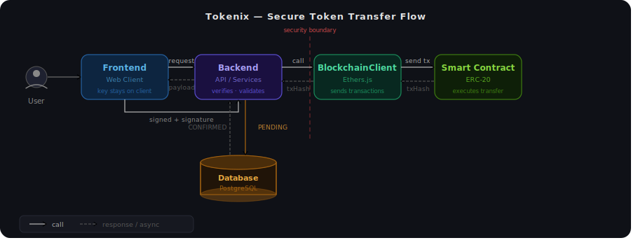

# Tokenix – Secure Digital Wallet for Blockchain Tokens

Tokenix is a full-stack project for user authentication, wallet creation, balance display, and backend-orchestrated token transfers on a local ERC-20 smart contract.
The repository combines a React frontend, an Express backend, PostgreSQL, and a Hardhat blockchain environment.



The current implementation is backend-centric:

* The frontend handles authentication and wallet creation UX.
* The backend is the central control layer for authentication, wallet persistence, transaction logging, and blockchain calls.
* Transfers are currently submitted through the backend.
* Client-side signing is not implemented yet.

Note:
The current implementation uses a backend-driven transfer model.
Client-side signing will be introduced in the next phase.

---

## Main Functional Requirements

Current functionality:

* Register and log in with email/password.
* Create a wallet from the frontend and persist its public address/public key in the backend.
* Display wallet token balance.
* Submit token transfers through the backend API.
* Record transaction states in the backend database (`PENDING`, `CONFIRMED`, `FAILED`).
* Expose transaction history via backend endpoints.

---

## Non-Functional Requirements

Current development setup:

* Use Docker Compose to run PostgreSQL, backend, frontend, and Hardhat locally.
* Store password hashes in PostgreSQL.
* Keep blockchain contract ABI/address synced into backend and frontend source folders.
* Track transfer lifecycle in the database and confirm blockchain transactions asynchronously.

---

## Technology Mapping

| Layer          | Technologies                                                    |
| -------------- | --------------------------------------------------------------- |
| Frontend       | React (Vite), login/register, wallet creation, balance display  |
| Backend        | Node.js / Express (API, auth, wallet, transfer, history)        |
| Smart Contract | Solidity (OpenZeppelin ERC-20), Hardhat, Ignition               |
| Database       | PostgreSQL                                                      |
| DevOps         | Docker, Docker Compose, GitHub Actions (CI/CD)                  |

---

## Security and Threat Modeling

The project includes a STRIDE threat analysis covering:

* Spoofing
* Tampering
* Repudiation
* Information Disclosure
* Denial of Service
* Elevation of Privilege

Current mitigations in this repository include authentication, password hashing, audit-oriented transaction logging, and separation between frontend, backend, and blockchain layers.

Important current-state note:

* There is no client-side signing flow yet.
* The backend currently submits transfers to the blockchain.
* The backend stores wallet public data only (`walletAddress`, `publicKey`) and does not persist a user private key.

---

## Repository Structure

```
├── backend         # Node.js / Express API server
│   ├── Dockerfile
│   ├── package.json
│   └── src
│       └── index.js
├── frontend        # React application (Vite)
│   ├── Dockerfile
│   ├── index.html
│   ├── package.json
│   ├── vite.config.js
│   └── src
│       ├── App.jsx
│       └── main.jsx
├── blockchain        # Hardhat project for smart contracts
│   ├── contracts
│   │   └── Token.sol
│   ├── ignition
│   │   └── modules
│   │       └── Token.cjs
│   ├── test
│   │   └── Token.js
│   ├── hardhat.config.cjs
│   └── package.json
├── docker-compose.yml  # Service orchestration
```

---

## Getting Started

### Prerequisites

* Docker and Docker Compose installed
* Node.js (for running services without Docker)

---

## Running the Full Stack (Recommended)

From the repository root:

```bash
docker compose up --build
```

Once running:

* Backend API: [http://localhost:3000](http://localhost:3000)

  * Health check: [http://localhost:3000/health](http://localhost:3000/health)
  * Contract health: [http://localhost:3000/health/contract](http://localhost:3000/health/contract)
* Frontend: [http://localhost:5173](http://localhost:5173)

How this works:

* The `hardhat` container starts a local node.
* Its entrypoint automatically runs `npm run full-deploy`.
* `full-deploy` compiles the contract, deploys it locally, and syncs the ABI/address into both backend and frontend.
* The backend reads the synced ABI/address from `backend/src/abi/MyToken.json`.

If you restart only the backend, it reuses the latest synced ABI file.
If you recreate the Hardhat chain, a fresh contract is deployed and the ABI/address are synced again during container startup.

### Quick Test Flow

1. Register a new user from the frontend.
2. Log in with the same credentials.
3. Let the app create a wallet automatically on first wallet load.
4. Confirm that the wallet address and token balance are displayed.
5. Send a transfer through `POST /transactions/transfer` with an authenticated request.

---

## Running Services Locally (Without Docker)

### Backend

```bash
cd backend
npm install
npm start
```

The backend listens on port 3000 and expects at least:

* `DATABASE_URL`
* `JWT_SECRET`
* `RPC_URL`

For local blockchain integration, the backend also expects `backend/src/abi/MyToken.json` to exist after contract deploy/sync.

### Frontend

```bash
cd frontend
npm install
npm run dev
```

The frontend development server runs on [http://localhost:5173](http://localhost:5173).

### Smart Contracts

```bash
cd blockchain
npm install
npx hardhat node
```

In a separate terminal:

```bash
cd blockchain
npm run full-deploy
```

This compiles the contract, deploys it to the local Hardhat network using `ignition/modules/Token.cjs`, and syncs `MyToken.json` into:

* `backend/src/abi/MyToken.json`
* `frontend/src/abi/MyToken.json`

After that, start or restart the backend so it loads the latest contract metadata.

### ABI and Contract Address Sync

The project uses `blockchain/scripts/sync-abi.js` to keep the contract metadata aligned across services.

Flow:

* Read the compiled ABI artifact from the Hardhat build output.
* Read the latest deployed contract address from the newest Ignition deployment folder.
* Write a combined `MyToken.json` file containing both `abi` and `address`.
* Copy that file into both backend and frontend.

This means the backend does not rely only on a hardcoded contract address. The runtime source of truth is the synced `MyToken.json` file when present.

### Current Blockchain Flow



Current end-to-end behavior:

1. User registers or logs in.
2. Frontend generates a wallet locally and sends only `walletAddress` and `publicKey` to the backend.
3. Backend stores the wallet and triggers initial funding on the local chain.
4. Frontend reads wallet balance through the backend.
5. Transfer requests are sent to the backend API.
6. Backend creates a `PENDING` transaction row, submits the transfer on-chain, stores the tx hash, and later marks it `CONFIRMED` or `FAILED`.

Important:

* There is no direct blockchain transfer flow from the main frontend app.
* There is no client-side signed transfer submission yet.
* Transaction history and statuses currently exist at the backend/API level; the main frontend does not yet expose a full history or transfer screen.

---

## Design and Testing

The system design follows UML principles, including:

* Use Case Diagrams
* Sequence Diagrams
* Class Diagrams
* ERD (Entity-Relationship Diagrams)

All components are developed using Test-Driven Development (TDD), with tests written before implementation using appropriate frameworks (e.g., Jest).

---

## Team Responsibilities

### Ilana Estrin — Backend · System Architecture · Security

Leads backend architecture and core system design.  
Responsible for authentication and authorization (JWT, RBAC), database schema and data integrity, API contract governance, transaction lifecycle orchestration, and system-wide security enforcement.

### Shely Zino — Frontend · Client Layer · Wallet Experience

Leads the client application architecture and user interaction layer.  
Responsible for the React frontend, wallet experience design, wallet creation flow, and full API integration including payload structure, status handling, and error management. Client-side signing and digital signature flows are part of the planned next phase.

### Lior Zvieli — Blockchain · Smart Contract · On-Chain Integration

Leads the blockchain and smart contract domain.  
Responsible for the ERC-20 smart contract design and deployment, on-chain logic (minting, transfers, validation), Ethers.js integration layer, and blockchain-level testing and reliability.

---

## Work Plan / MVP

Implemented now:

* Backend API with auth, wallet creation, balance lookup, transfer endpoint, and transaction history endpoint.
* React frontend with login, register, wallet creation, and balance display.
* Solidity ERC-20 smart contract with local deployment scripts.
* Docker Compose setup for running all components together.
* Transaction status tracking in PostgreSQL.

Not yet implemented in the main frontend:

* Transfer UI
* Transaction history UI
* Admin area
* Client-side signing flow

## Planned Architecture (Next Phase)

The next phase is planned to move the system toward a stronger wallet-security model.

Target architecture:

* Client-side signing for user transfers.
* Backend verification of signed payloads before submission.
* Backend remains the central control layer for auth, business rules, transaction tracking, and policy enforcement.
* No user private key stored on the server.
* No direct blockchain submission from the production frontend flow.

Target product flow:

`login -> wallet -> balance -> transfer (sign -> submit) -> history`

Planned transfer flow:

1. Frontend prepares the transfer payload.
2. Client signs the payload locally.
3. Frontend sends the signed payload to the backend.
4. Backend verifies the signature and validates business rules.
5. Backend submits the transaction and tracks lifecycle/status.
6. Frontend shows transaction history and final status updates.
